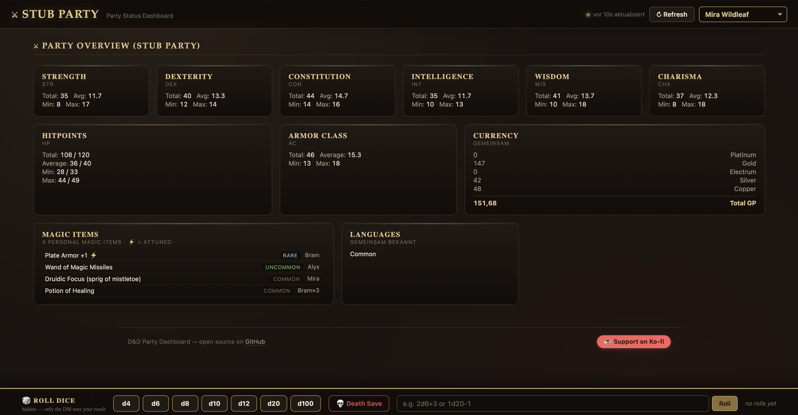
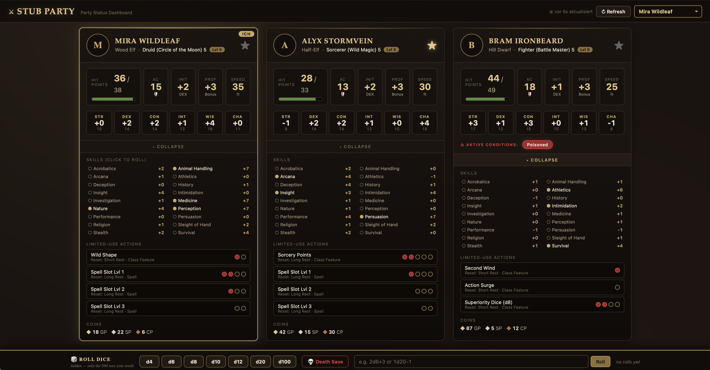
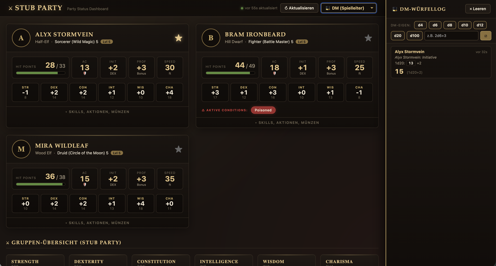

# D&D Party Dashboard

A self-hosted, browser-based party dashboard for tabletop D&D 5e games. Pulls
character data live from [D&D Beyond](https://www.dndbeyond.com), shows your
whole party at a glance, and ships with a hidden dice-rolling system so the
DM sees player rolls before the players do.





> _Screenshot placeholder — drop your own into `docs/screenshot-dashboard.png`._

## Features

- **Live D&D Beyond sync** — auto-refreshes every minute, no manual data entry
- **Party at a glance** — HP, AC, Speed, all six stats, saving throws, skills,
  conditions, magic items, limited-use actions, death saves
- **Group overview panel** — totals, averages, min/max across the whole party
- **Hidden dice rolls** — players click a die, the DM sees the result in a
  side panel, the player sees only confirmation (perfect for stealth/insight
  rolls where the DM should narrate the outcome)
- **Advantage / Disadvantage / arbitrary expressions** — `1d20`, `2d6+3`,
  `4d6kh3` (keep-highest 3), `1d20kl1` (keep-lowest 1, = disadvantage)
- **DM login via secret token link** — no password to leak, no account system
- **Mobile-friendly** — sticky bottom dice panel on phones, side panel on
  desktop
- **No tracking, no cloud** — runs entirely on your own host



## Requirements

- **PHP 7.4+** with `curl` (or `allow_url_fopen` as a fallback)
- **Apache** with `mod_rewrite` enabled
- Outbound network access to `character-service.dndbeyond.com`
- Tested on **Synology DS218 / Web Station**, but any LAMP host works

## Setup on Synology Web Station

1. **Install packages** (DSM Package Center):
   - Web Station
   - PHP 7.4 (or newer)
   - Apache HTTP Server 2.4
2. **Create a virtual host** in Web Station pointing at a folder on your NAS,
   e.g. `/web/party/`. Make sure PHP is enabled for it.
3. **Upload all files** from this repo into that folder:
   ```
   /web/party/
   ├── api.php
   ├── dashboard.html
   ├── index.html
   ├── .htaccess
   ├── config.example.php
   ├── server.py        ← optional, only for local dev
   └── start.command    ← optional, macOS launcher for server.py
   ```
4. **Create your local config**:
   ```sh
   cp config.example.php config.php
   ```
   Edit `config.php` and fill in:
   - `group_name` — your party's display name
   - `group_slug` — lowercase slug used for cookies (pick once, keep forever)
   - `character_ids` — array of D&D Beyond character IDs (see below)
   - `kofi_username` — optional, leave empty to hide the donate button
5. **Make the folder writable** for the web server user so `rolls.dat` and
   `dm-tokens.dat` can be created at runtime:
   ```sh
   sudo chown http:http /web/party
   sudo chmod 775 /web/party
   ```
6. **Open the dashboard**: `https://your-nas.example.com/party/`

## Setup on any LAMP host

Same as above, minus the Synology-specific steps:

```sh
git clone https://github.com/SmokinAleks/dnd-party-dashboard.git
cd dnd-party-dashboard
cp config.example.php config.php
# edit config.php
sudo chown -R www-data:www-data .   # or whichever user runs Apache
```

Make sure `mod_rewrite` is enabled and the `<Directory>` block in your Apache
config allows `AllowOverride All` so `.htaccess` takes effect.

## Finding D&D Beyond character IDs

Open a character sheet on dndbeyond.com. The URL ends with the ID:

```
https://www.dndbeyond.com/characters/12345678
                                     ^^^^^^^^
                                     this number
```

The character must be set to **Public** on D&D Beyond for the dashboard to
read it. (Private characters will show as a locked placeholder card.)

## First run — claiming the DM token

The first time you set up the dashboard, you need to claim the DM session:

1. Open `https://your-host/?dm-setup` in any browser.
2. Click "Generate link". Copy the resulting URL.
3. Open that URL in **your own browser** (not the one running the player view).
4. You are now logged in as DM — the DM sidebar appears at the right.

The DM cookie is valid for one year. To revoke it: clear cookies or call
`POST /api/dm/revoke`.

## Local development

For UI tweaks without running PHP/Apache, you can use the included Python
dev server:

```sh
python3 server.py
```

It serves the static files and provides a stub `/api/*` so the dashboard
boots with placeholder data. Useful for iterating on CSS/JS.

On macOS, double-clicking `start.command` does the same.

## Configuration reference

All settings live in `config.php` (created from `config.example.php`):

| Key                | Type        | Required | Purpose                                                    |
| ------------------ | ----------- | -------- | ---------------------------------------------------------- |
| `group_name`       | `string`    | yes      | Display name in tab title and header                       |
| `group_slug`       | `string`    | yes      | Lowercase slug, used for DM cookie + localStorage          |
| `character_ids`    | `int[]`     | yes      | D&D Beyond character IDs to display                        |
| `ac_overrides`     | `array`     | no       | `[charId => AC]` — overrides DDB's computed AC             |
| `speed_overrides`  | `array`     | no       | `[charId => speedFt]` — overrides DDB's computed speed     |
| `kofi_username`    | `string`    | no       | Shows a "Support on Ko-fi" footer button when set          |

## Privacy & security notes

- **Public characters only**: D&D Beyond only serves "Public" character JSON.
  Set your characters to Public in their DDB privacy settings.
- **`rolls.dat`** stores the dice log (player name, expression, result,
  timestamp). Blocked from web access by `.htaccess`.
- **`dm-tokens.dat`** stores active DM session tokens. Blocked from web
  access by `.htaccess`.
- **`config.php`** is in `.gitignore` so your character IDs never leak into
  a public fork.
- No third-party analytics, no telemetry, no external assets beyond
  D&D Beyond itself.

## Contributing

Bug reports and PRs are welcome. Open an issue on
[GitHub](https://github.com/SmokinAleks/dnd-party-dashboard/issues) describing
what you saw, what you expected, and ideally how to reproduce it.

For feature requests, please describe the table situation that motivated it —
that helps a lot in deciding whether something is generally useful or fits
better as a fork.

## License

[MIT](LICENSE) — do what you like, just keep the copyright notice.

## Support the project

This tool is free and stays free. If it makes your table's sessions smoother,
the maintainer happily accepts a coffee on
[Ko-fi.com/smokinaleks](https://ko-fi.com/smokinaleks) — but never feel
obligated. Bug reports, feature requests, and PRs are just as appreciated.

GitHub Sponsors button at the top of the repo page works too (it's the same
Ko-fi link, just nicer to click).
